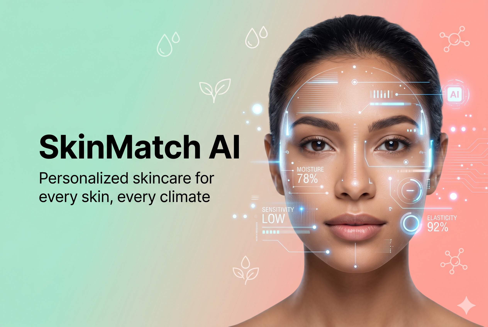

<div align="center">



# ✨ SkinMatch AI

### *Personalized skincare for every skin, every climate*

[](https://devpost.com)
[](https://nextjs.org)
[](https://typescriptlang.org)
[](https://vercel.com)

[](https://yce.perfectcorp.com)
[](https://crusoecloud.com)
[](https://truefoundry.com)

**[🚀 Live Demo](#) · [📹 Demo Video](#) · [📄 DevPost](#)**

</div>

---

## 🌍 The Problem

The global skincare market is worth **$189.3 billion** — yet most AI-powered skincare solutions are built for Western, 4-season climates, leaving billions of users behind.

| Stat | Source |
|------|--------|
| **37%** of Gen Z feel overwhelmed buying skincare | Professional Beauty UK, 2026 |
| **63%** of people don't know their real skin type | Skin Trust Club / Labskin, 2022 |
| **90%** of consumers frustrated finding skincare that works | Drive Research, 2025 |
| **68%** want personalized skincare — but AI tools fail tropical skin | Business Research Insights, 2026 |

> Tropical skin types (oily, humid-climate, acne-prone) have fundamentally different needs — yet no major AI tool addresses this gap.

---

## 💡 The Solution

**SkinMatch AI** is a web app that uses computer vision and AI to deliver hyper-personalized skincare routines — with a unique focus on **tropical and diverse skin types** that are underserved by existing solutions.

```
📸 Upload selfie  →  🔬 AI analyzes skin  →  🤖 LLM generates routine  →  🛍️ Get product recs
```

---

## ✨ Features

### MVP (Shipped)
| Feature | Description |
|---------|-------------|
| 📸 **Face Photo Upload** | Mobile-friendly upload or live camera capture |
| 🔬 **AI Skin Analysis** | Perfect Corp CV detects skin type, tone & 8 concerns |
| 🤖 **Routine Generator** | Morning & night routine by Nvidia Nemotron LLM |
| 🛍️ **Product Recommendations** | Curated global products (CeraVe, The Ordinary, Cosrx, etc.) |
| 📊 **Skin Report Card** | Shareable summary of all analysis results |
| 🌴 **Tropical Climate Focus** | Built for Gen Z in Southeast Asia, Africa & Latin America |
| ♻️ **5-Level Fallback** | Always returns a response — even when all LLMs are down |

---

## 🏗️ Architecture

### 5-Level Resilient LLM Fallback Chain

```
📸 Skin Analysis Results (Perfect Corp)
              ↓
   ┌─────────────────────────┐
   │  L1: TrueFoundry        │  ← AI Gateway (routing + monitoring)
   │      AI Gateway         │    Priority: Nemotron → Llama → Qwen
   └────────────┬────────────┘
                │ ❌ Gateway down
                ↓
   ┌─────────────────────────┐
   │  L2: Nemotron direct    │  ← Crusoe Cloud Managed Inference
   │  (Crusoe Cloud)         │    hack-crusoe/Nemotron-3-Nano-30B
   └────────────┬────────────┘
                │ ❌ Nemotron unavailable
                ↓
   ┌─────────────────────────┐
   │  L3: Llama 3.3 direct   │  ← Crusoe Cloud
   │  (Crusoe Cloud)         │
   └────────────┬────────────┘
                │ ❌ Llama unavailable
                ↓
   ┌─────────────────────────┐
   │  L4: Qwen direct        │  ← Crusoe Cloud
   │  (Crusoe Cloud)         │
   └────────────┬────────────┘
                │ ❌ All LLMs down
                ↓
   ┌─────────────────────────┐
   │  L5: Static JSON        │  ← Pre-written routines by skin type
   │  Rules Engine           │    Zero dependency, always works
   └─────────────────────────┘
              ↓
   ✅ User always gets a response
   💰 Total infra cost: $0
```

---

## 🛠️ Tech Stack

| Layer | Technology | Purpose |
|-------|-----------|---------|
| **Frontend** | React 19 + Next.js 15 | SSR + API routes |
| **Styling** | Tailwind CSS v4 + Framer Motion | Animations & glassmorphism UI |
| **AI Skin Analysis** | Perfect Corp API | CV skin detection (type, tone, concerns) |
| **LLM Primary** | Nvidia Nemotron via Crusoe Cloud | Routine generation |
| **LLM Fallback 1** | Llama 3.3-70B via Crusoe Cloud | First resilience layer |
| **LLM Fallback 2** | Qwen3-235B via Crusoe Cloud | Second resilience layer |
| **LLM Fallback 3** | Static JSON rules engine | Final fallback, zero dependency |
| **AI Gateway** | TrueFoundry AI Gateway | LLM routing, retries, observability |
| **Deployment** | Vercel | Global CDN, auto-deploy from GitHub |

> 💰 **Total project cost: $0** — 100% powered by hackathon sponsor credits

---

## 🏆 Sponsor Challenges

| Sponsor | Challenge | How SkinMatch AI Satisfies It |
|---------|-----------|-------------------------------|
| 🎨 **Perfect Corp** | AI-driven consumer experience ($2,500) | Face analysis → personalized skincare UI |
| ☁️ **Crusoe Cloud** | Run Nemotron on Crusoe Cloud (DGX Spark) | Nemotron-3-Nano-30B + Llama + Qwen on Crusoe |
| 🔧 **TrueFoundry** | Resilient Agents ($1,500) | Full 5-level fallback chain via TrueFoundry Gateway |

---

## 🚀 Getting Started

### Prerequisites
- Node.js 18+
- API keys (see Environment Variables below)

### Installation

```bash
# Clone the repo
git clone https://github.com/Zenidp/skinmatch-ai.git
cd skinmatch-ai

# Install dependencies
npm install

# Set up environment variables
cp .env.example .env.local
# Fill in your API keys in .env.local

# Run development server
npm run dev
```

Open [http://localhost:3000](http://localhost:3000) in your browser.

---

## 🔑 Environment Variables

Create `.env.local` with the following:

```env
# Perfect Corp API (Skin Analysis)
# Get your key at: https://yce.perfectcorp.com/api-console
PERFECTCORP_API_KEY=your_api_key
PERFECTCORP_APP_SECRET=your_app_secret

# Crusoe Cloud Managed Inference
# Get key at: https://console.crusoecloud.com → Intelligence Foundry
CRUSOE_API_KEY=your_crusoe_api_key

# TrueFoundry AI Gateway
# Set up at: https://app.truefoundry.com → AI Gateway → Virtual Models
TRUEFOUNDRY_API_KEY=your_truefoundry_token
TRUEFOUNDRY_GATEWAY_URL=https://gateway.truefoundry.ai
TRUEFOUNDRY_MODEL_ID=your-group/your-model

# App
NEXT_PUBLIC_APP_URL=http://localhost:3000
```

---

## 📁 Project Structure

```
skinmatch-ai/
├── app/
│   ├── page.tsx              # Landing page (hero, features, CTA)
│   ├── analyze/page.tsx      # Photo upload & camera capture
│   ├── results/page.tsx      # Skin report card
│   └── api/
│       ├── analyze/route.ts  # Perfect Corp API handler
│       └── routine/route.ts  # LLM fallback chain handler
├── components/
│   ├── CameraCapture.tsx     # Upload / webcam / preview
│   ├── SkinReportCard.tsx    # Results display
│   ├── RoutineStep.tsx       # Morning/night routine steps
│   ├── ProductCard.tsx       # Product recommendations
│   └── FallbackBanner.tsx    # UI notice when fallback active
├── lib/
│   ├── perfectcorp.ts        # Perfect Corp API client
│   ├── fallback-chain.ts     # 5-level LLM orchestrator
│   ├── llm-gateway.ts        # TrueFoundry Gateway client
│   ├── crusoe.ts             # Crusoe Cloud client
│   └── static-routines.ts   # Static fallback reader
└── data/
    └── static-routines.json  # Pre-written routines (5 skin types)
```

---

## 🎯 Target Users

| Segment | Description |
|---------|-------------|
| **Primary** | Gen Z (15–25), globally — especially Southeast Asia, Latin America, Africa |
| **Secondary** | Millennials (25–35) new to skincare |
| **Tertiary** | Skincare brands seeking white-label AI advisor |

---

## 📈 Market Opportunity

- Global skincare market: **$189.3B** (2026) → **$310.6B** by 2033
- AI beauty personalization: **$2.3B** → **$16.4B** by 2036 at **21.7% CAGR**
- Asia-Pacific leads with **47% regional expansion** in tech-driven beauty

---

## 🗺️ Roadmap

- [x] AI skin analysis (Perfect Corp)
- [x] LLM routine generation (Nemotron via Crusoe)
- [x] 5-level resilient fallback chain (TrueFoundry)
- [x] Animated UI with Framer Motion
- [x] Mobile-responsive with camera support
- [ ] Climate Mode toggle (tropical / temperate / cold)
- [ ] Budget filter ($, $$, $$$)
- [ ] Progress tracker (compare results over time)
- [ ] Routine reminder notifications

---

## 👤 Developer

Built solo in 3 days for the **DevNetwork AI + ML Hackathon 2026**.

**zenidp** · [GitHub](https://github.com/Zenidp)

---

<div align="center">

**Built with ❤️ for tropical skin everywhere**

*Powered by Perfect Corp × Crusoe Cloud × TrueFoundry*

</div>
